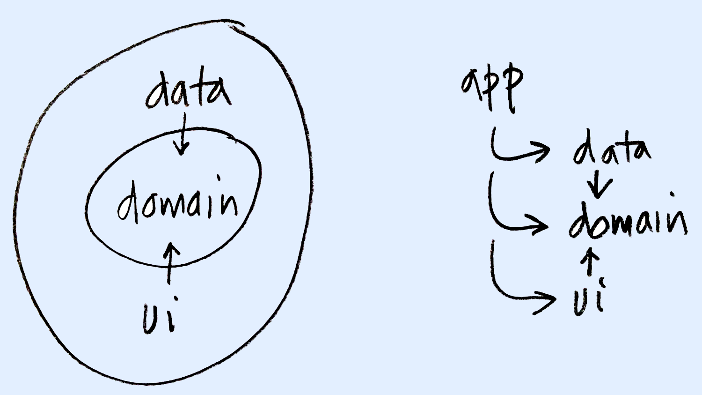

** Archived, see 
https://github.com/erdo/commercial-template instead **

# Clean Architecture and Jetpack Compose UI

Based on a previous [clean architecture sample](https://github.com/erdo/clean-modules-sample) (which was written with xml based UI). As well as being setup with clean kotlin modules, this version is setup for compose UI and uses kotlin based gradle files, buildSrc plugins, and koin for DI

## Clean modules

This is how the kotlin modules are arranged (domain is implemented as a pure kotlin module). The app module (being the only module that can see all other modules) is used for DI.



# App template
In case you want to use this app as a starting point for something else, there is a bash script included that will rename the app packages (it's written for mac, use at your own risk).

```
git clone git@github.com:erdo/clean-compose-sample.git
cd clean-compose-sample
chmod u+x change_package.sh
./change_package.sh -p com.mydomain.myapp
```
Then open the app as usual in AS. You'll have to change the readme & the app icon yourself. And logcat can be filtered with: myapp_ (if you don't run the change_package script, logcat can be filtered with: clean_)

This repo is also setup as a **github template repository** so you might want to run the script after selecting "Use this template" on the github UI first (of course you'll have to change "erdo/clean-compose-sample" to whatever you called your new repo).

If you want to submit a PR though, you'll need to fork the repo, not template it.

# License

    Copyright 2015-2022 early.co

    Licensed under the Apache License, Version 2.0 (the "License");
    you may not use this file except in compliance with the License.
    You may obtain a copy of the License at

       http://www.apache.org/licenses/LICENSE-2.0

    Unless required by applicable law or agreed to in writing, software
    distributed under the License is distributed on an "AS IS" BASIS,
    WITHOUT WARRANTIES OR CONDITIONS OF ANY KIND, either express or implied.
    See the License for the specific language governing permissions and
    limitations under the License.
